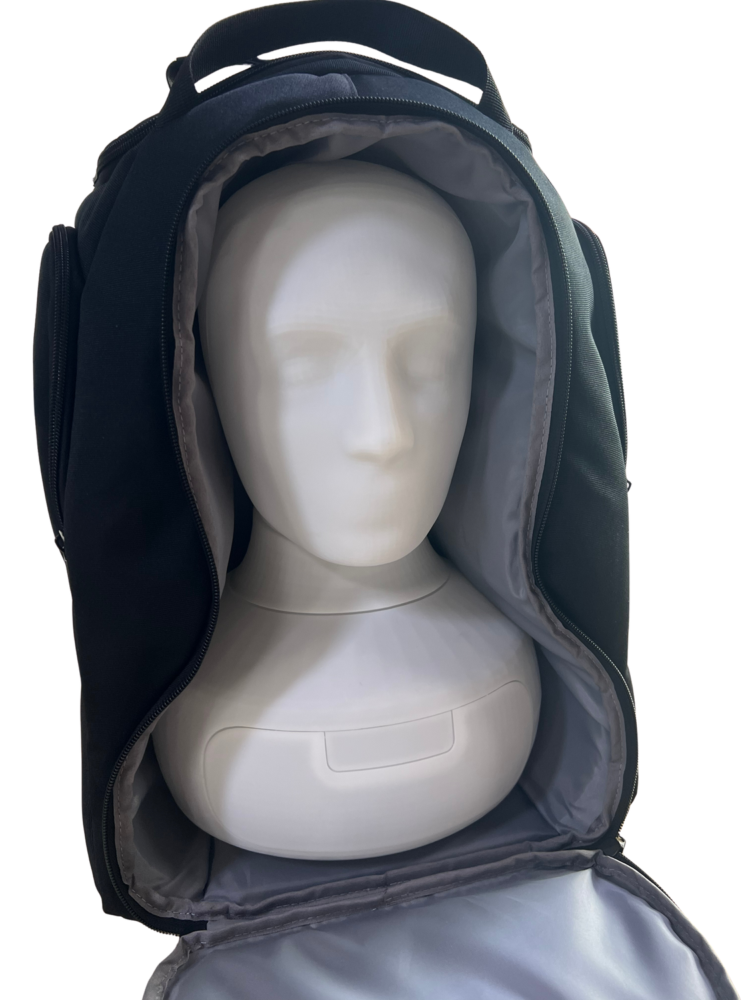
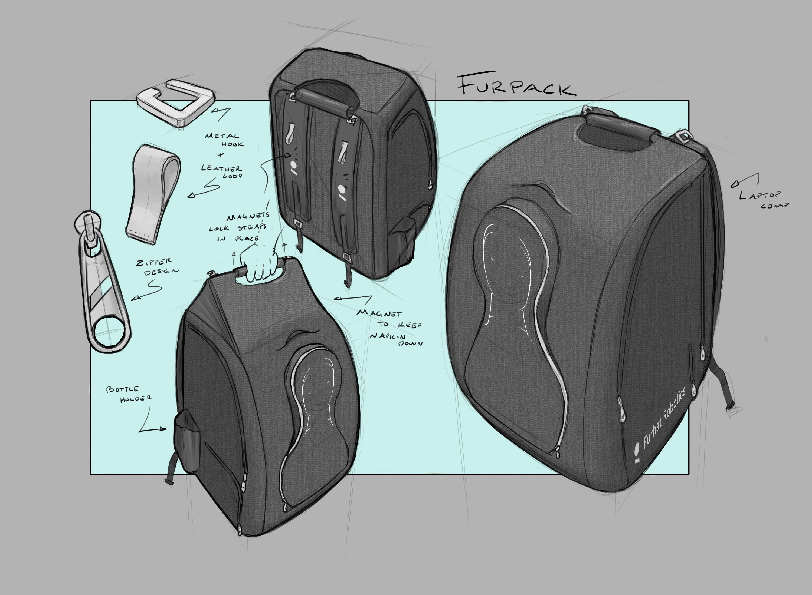
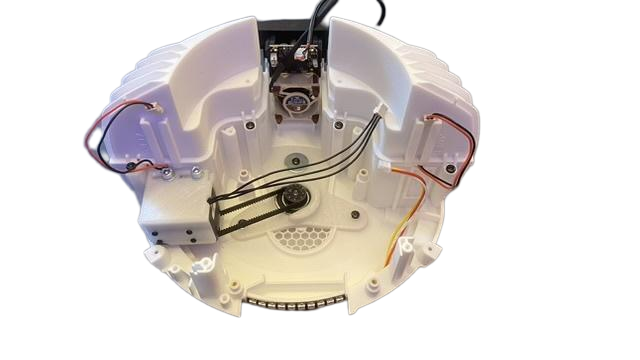
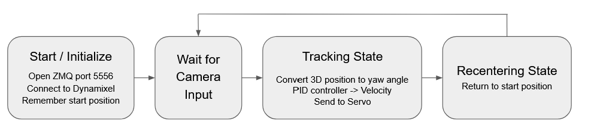

# Implementation brief: AK Robotics portfolio

Version 2: expanded using the three supplied project papers.

## Task and scope

Refine Anton Kuehr's existing robotics portfolio at https://antonkuehr.github.io/akrobotics/ rather than giving it a new identity. Work in the actual current repository and inspect its HTML, styles.css, site.js, and existing assets first. Public search/extracted page text may show older versions; do not replace newer repository content with an older cached version.

The two problems to solve are:

1. Education, Jobs, and Volunteering use visually heavy cards with inefficient information layout.
2. The six project pages need a consistent reading structure, clearer evidence and personal attribution, and less repetitive, generic writing.

Relevant files are index.html, robotic-skin.html, furhat-audio.html, furpack.html, furhat-360.html, cobot.html, harvesting-robot.html, styles.css, and site.js.

Keep the current navigation, home-page section order and anchors, hero, About section, portfolio overview/grid, project order, Skills layout, Contact area, and previous/next project navigation. Preserve current image treatments on the home-page project cards. Source-supported corrections to project-card summaries are allowed, but not a redesign of the grid. These are protected areas, apart from small, explicitly identified copy corrections and fixes required to avoid regressions. Do not redesign the whole site, migrate frameworks, introduce a build system, add a CMS, or deploy changes without a separate instruction.

## Source update: three papers are now available

This is the complete updated implementation prompt, not an addendum that needs to be combined with an older prompt. Retain the design and navigation requirements below. The earlier requests to obtain basic mechanisms, methods, and results for the skin, audio, and cobot projects are now largely resolved by these sources.

Use the following source identifiers throughout your working notes:

| ID | Supplied document | Page convention |
|---|---|---|
| **SKIN** | `Paper_Taktile_Sensorik_für_kollaborative_Robotik.pdf`, by Fabio Elias Jain and Anton Kuehr; title: *Machbarkeitsstudie zur grossflaechigen taktilen Wahrnehmung in Robotersystemen*. | Printed pages and PDF viewer pages both run from 1 to 8. |
| **COBOT** | `SIR Abschlussbericht 2025 - Jain, Kühr, Lübken, Sondenheimer, Tolkovets.pdf`; *Kollaboratives Arbeiten - Greifarm und Mensch*, submitted 26 February 2025 by Fabio Jain, Anton Kuehr, Timon Luebken, Lukas Sondenheimer, and Denis Tolkovets. | Printed page number equals PDF viewer page number. |
| **AUDIO** | `Bachelor's Thesis Anton Kuehr (print).pdf`; *Investigation of the Influence of Mechanical Microphone Implementation on ASR Performance*, submitted 27 March 2026 by Anton Karl Ludwig Kuehr. | For the numbered main text, PDF viewer page = printed page + 10. Example: printed p. 59 is PDF p. 69. |

Source references such as `[AUDIO, Section 9.1, printed p. 59 / PDF p. 69]` below are for implementation traceability. They are not strings to paste indiscriminately into the public page. Keep a source-to-claim record in `CONTENT_SOURCES.md`; public source links should appear only where authorised and useful.

Read the relevant source sections and inspect the indicated figures when implementing. Distinguish the reports' own prototypes and experiments from their literature reviews, proposed features, manufacturer benchmarks, and future work. Do not copy the reports' generic introductions or academic chapter structure into the website. The expanded project notes below are an evidence bank and editorial plan, not an instruction to publish every detail.

Where a source is internally inconsistent, or disagrees with an existing page, flag the exact discrepancy in `CONTENT_GAPS.md`. Do not silently reconcile numbers, invent an explanation, or replace one metric with another. The implementation sections of a report can establish what was actually built; explicitly record when that differs from its earlier concept description.

The papers do not establish the individual division of labour in the two team projects, the current status of Project Echo, or new facts about Furpack, Furhat 360, and the harvesting robot. Continue the redesign using verified information without blocking everything on those gaps. Use team-level wording where individual ownership remains unresolved.

## Additional source update: Furpack and Furhat 360 folders

The original three-paper brief remains intact. The additions in project sections 3 and 4 now provide project-specific evidence from the two supplied folders. They resolve several of the earlier requests for basic mechanisms, prototype discoveries, manufacturer feedback, and documented development endpoints. They do not establish subsequent production, a current deployment status, or the individual division of labour. Read the remaining-question update below alongside the original questions table.

Use these local source roots with the relative paths in the new project notes:

- **FURPACK root:** `/Users/antonkuhr/Documents/Arbeit/Furhat/Furpack/`
- **ROTATION root:** `/Users/antonkuhr/Documents/Arbeit/Furhat/360 Rotation/`

The selected source images are supplied beside this prompt in `akrobotics-project-assets/`. Keep that folder beside the Markdown file when moving the prompt, or use the accompanying ZIP containing both. The image tables identify the original files or embedded document images, their development stage, and their suggested use. These are candidate assets for the existing media rules, not a requirement to publish every image. Local inclusion for author review does not change the existing publication rules for internal material or supplier photographs. No entire internal report, invoice, supplier contact details, or commercial terms have been included in the image bundle.

## Design direction: an editorial engineering portfolio

Use the existing dark green identity, restrained mint accent, Space Grotesk headings, Inter body text, and subtle background grid. Reuse the current CSS tokens, checking the repository first. The reviewed source used background #071c17, text #f1f8f4, secondary text #c9ddd4, accent #8fd7b5, and portfolio image background #b8cbbd. Do not change those values just to make the redesign look different.

Create hierarchy through alignment, readable type, thin rules, and deliberate spacing, not more boxes. Keep normal body text at approximately 16px or the user's existing size; do not shrink text to achieve compactness. Use a consistent spacing scale such as 8/12/16/24/32/48/64px, without turning every short paragraph into a large empty section.

Remove filled card backgrounds, full perimeter borders, thick accent top borders, and pronounced rounding from Education, Jobs, and Volunteering. Images and genuinely interactive controls can retain the site's modest corner treatment. Do not add gradients, glass effects, drop shadows, decorative icon libraries, skill progress bars, carousels, or scroll-triggered entrances.

## Home page: a shared CV-row pattern

Use the same compact row component for Education, Jobs, and Volunteering. At desktop widths, use a muted date column of roughly 140-170px, a flexible main content column, and a disclosure control. Keep all three sections on a consistent, approximately 850-900px maximum reading grid within the existing page container. Adjust this only after reviewing the actual composition.

The main column contains the role or qualification, organisation, location, and one short differentiating detail where useful. Date, organisation, location, and status must not each occupy an unnecessarily separate full-width line. Allow natural wrapping. Separate rows with subtle horizontal rules, not individual panels. Start with about 20-24px of vertical padding per row and adjust for readable wrapping.

Optional organisation logos should be small, approximately 28-36px, and secondary to the text. Do not recolour or distort logos. Do not retain large white logo tiles merely as decoration. Align rows consistently when some entries have no logo.

### Visible information and progressive disclosure

A closed featured row must still identify the qualification or role, organisation, dates, and a useful short context/result. Do not hide all meaningful information behind clicks. For the BSc, keep the final grade visible. For Furhat, make both the internship and thesis phases recognisable without forcing a visitor to open several controls.

Expand an individual featured row inline, under its main text column. Constrain expanded prose to about 60-70 characters per line. The open state must remain visually part of the same row: no inset card, oversized full-width content block, or modal.

For Education, initially show the MSc and BSc rows. Their expanded content retains descriptions and relevant links. Keep the scholarship and radio interview associated with the BSc, preserving their information and evidence links. Put Abitur under an unobtrusive earlier-education disclosure; do not delete it.

For Jobs, initially show Furhat and the TH Köln tutoring/Scrum role. Furhat is one employer entry with the two dated phases inside its expanded content, not a set of nested cards. Retain the existing earlier jobs behind one clearly labelled control. When revealed, these earlier entries should be compact and readable directly, rather than hiding each again behind another disclosure.

For Volunteering, initially retain the existing three featured activities. Replace the three-column card grid with the same row pattern. Retain the other activities behind one clearly labelled control. Short entries with no additional information or documents need no individual disclosure.

Use labels such as "Earlier roles (3)", "More volunteering (4)", and "Earlier education", with counts derived from the actual content. Do not use "volunteerings". Distinguish a control that reveals more entries from one that reveals details about a single entry. Do not create multiple levels of nested accordions.

### Interaction requirements

Use semantic native details/summary for straightforward disclosures, or an equivalent accessible button/panel relationship if needed by the layout. Keep the opener visible and operable when its section is expanded. Do not replace it with a close control only at the bottom, force scrolling on expansion, or move focus unnecessarily. Allow several rows to remain open.

Do not nest external links inside a disclosure trigger. Keep organisation, document, and project links separately operable, including placing them in the expanded content when appropriate. Preserve every existing destination. Maintain visible keyboard focus, meaningful control names, and comfortably sized touch targets. Essential content must remain available without JavaScript. Honour reduced-motion settings; animation is optional, not a requirement.

On narrow screens, move dates above the title, keep the control next to the heading, and let organisation/location wrap underneath. Eliminate horizontal overflow, fixed heights, and alignment achieved with manual line breaks.

## Project pages: one shared case-study structure

Use a common semantic HTML skeleton and shared CSS across all six projects. Standardise the order and hierarchy, not the exact number of paragraphs or images. A product-development case study does not need invented numerical results to resemble an experimental thesis.

### 1. Project header and quick overview

Show the project title, one short factual description, and a compact unboxed metadata area containing the period, context, status, and Anton's actual contribution. Place collaborators in a subdued text line with their existing links, not prominent decorative pills. Make the division between Anton's work and team work clear. Do not infer ownership from a skills list.

Put the principal demonstrated result or current status near the top, together with one genuinely informative image or an accessible demo entry point. Keep it short enough that the first screen is not consumed by a giant heading and a tall empty hero. A headline result is orientation for the reader; the evidence and qualifications belong in the body.

Preserve the current dates unless authoritative source material establishes a correction. Employment tenure and the active dates of a project can legitimately differ; label them instead of forcing them to match. For robotic skin, preserve the separate BSc and Project Echo periods, rather than implying uninterrupted development.

### 2. Context and my role

Briefly explain the actual task, the relevant constraints, and Anton's individual responsibilities. Name what teammates or an existing platform supplied when that distinction matters. Avoid general introductions explaining why robotics, perception, or prototyping are important.

### 3. Design and implementation

Organise the main story around two or three significant engineering decisions. For each, explain the constraint, the chosen approach, the reason for the choice, and what was observed. Use descriptive headings, not repeated aspirational slogans. A chronological account is acceptable where it explains a decision, not merely because a sequence of images exists.

### 4. Results and limitations

Present the actual test, demonstrated capability, manufactured/prototyped deliverable, or current investigation status. Put metric definitions, baselines, units, and test scope next to the numbers. Keep measured, qualitatively demonstrated, planned, and inferred claims distinct.

Include the most important limitation or unfinished aspect. Do not add a second decorative "Outcome" panel that restates the same result. Deeper methods, derivations, or additional prototype photographs can be in clearly labelled optional technical notes. Never hide the main result, Anton's role, or an essential caveat there.

### 5. Resources and onward navigation

Provide a quiet text-link row for existing authorised resources: demonstration, report, thesis, repository, or presentation. Omit unavailable resources instead of publishing disabled buttons. Keep the existing previous/next navigation and return-to-portfolio behaviour. Do not add a new global navigation system.

## Shared layout and media rules

Use a narrow prose column, approximately 60-70 characters per line, within a wider project container. Keep headings, copy, figures, captions, and metrics aligned to an explicit shared grid. Avoid alternating layouts for decoration.

Create a small set of explicit reusable variants: text-only section, text with supporting figure, full-width technical figure, image pair, video, and compact results block. Do not infer the entire layout from whether a section happens to contain an img element. Replace manual br/br spacers and nested gallery/copy wrappers with semantic grouping and CSS gap/margin.

For a split section, do not let the text become a narrow strip beside a large empty image area. Stack content at a breakpoint appropriate to readability. Technical diagrams and results figures may span the wider container; ordinary paragraphs must not become full-page-width lines.

Preserve the aspect ratios of technical diagrams. Do not crop labels, stretch figures, recolour data, invert CAD drawings, or force every asset into a single height. Use a restrained neutral backing where an existing technical figure needs one. Keep a consistent caption style. Captions should explain what the reader should notice, not repeat the section heading.

Provide an accessible full-size image link when a technical figure needs closer inspection. Preserve normal video controls and actual video aspect ratios; no autoplay. Load secondary media lazily. Keep core content available when an external video cannot load.

If diagrams are redrawn later, use a consistent typography and annotation style, while preserving all source data and relationships. Do not generate replacement technical evidence or fabricate plots.

## Editorial rules and source discipline

Use direct British English. Avoid em dashes, unnecessary superlatives, repeated "From X to Y" headings, and vague statements about combining disciplines, coherent workflows, or the value of the experience.

Prefer a concrete action, decision, or observation to an adjective. Use "I" only for verified personal contributions and "we" for team results. Preserve collaborators' names, correct spellings, and links. Do not convert exploratory work into a validated system, a prototype into a shipped product, or a metric from one subsystem into success for the whole robot.

Do not invent results, dimensions, hardware specifications, test counts, safety claims, manufacturing status, user studies, commercial partners, or publications. Do not pad a short project to reach the same length as another. Aim for a focused main narrative of roughly 350-650 words where the material supports it; this is a guide, not a quota.

When information is missing, record the exact question in a separate CONTENT_GAPS.md with the relevant project and section. Do not publish placeholder numbers, speculative explanations, or visible TODOs. Preserve uncertain existing claims for author review and flag them rather than silently strengthening them.

User-supplied reports are evidence for drafting, not automatic permission to publish the files. Do not upload entire reports, private correspondence, supplier terms, pricing, or internal company material without explicit approval. Offer source-grounded summaries and authorised excerpts instead.

## Project-specific content actions

### 1. Robotic skin: `robotic-skin.html`

**Editorial focus:** explain how a low-cost, layered electrical contact matrix detects touch position and distinguishes two pressure levels. Keep this completed BSc feasibility study separate from Project Echo. The paper is not evidence of a completed humanoid-wide skin installation.

#### Main-page information to add

**Mechanism.** The sensor uses conductive tracks sewn onto textile layers, not pressure-sensitive conductive foam. Perpendicular sender and receiver tracks form a matrix. A perforated elastic separator keeps them apart without a load; pressing the surface compresses the separator and allows tracks to touch through its openings. The controller activates sender tracks sequentially and reads the receiver tracks. The active sender and contacted receiver identify a matrix location. Different separator configurations and stacked sensing layers allow two discrete pressure levels to be distinguished. Describe these as contact/pressure thresholds, not continuous force measurements in newtons. [SKIN, Sections 2.1-2.3, p. 2; Sections 3.3.1-3.3.3, pp. 3-5.]

**Prototype.** The implementation has an 8 x 8 matrix, giving 64 sensing locations, with 8 mm track-centre spacing and 5 mm-wide conductive tracks. It supports two active pressure levels plus the no-contact state. A third pressure level appears in the communication protocol as provision for a future extension, not as an implemented capability. The sensing stack consists of one sender layer, two receiver layers, and two separators; the schematic also shows protective covers. Do not imply that every layer is conductive or confuse the covers with extra sensing levels. [SKIN, Section 3, p. 3; Section 3.3.3, p. 5; Figure 1, p. 2.]

**Materials and design decisions.** Conductive Madeira HC-12 thread was sewn in zigzag tracks onto denim, selected because it could be sewn and resisted tearing. Laser-perforated EVA foam provided the elastic separation. This avoided the more elaborate conductive printing and plating processes considered in the paper. Separator thickness and perforation were the mechanical means of setting the triggering threshold. An Arduino Uno and serial-in/parallel-out and parallel-in/serial-out shift registers reduced the number of microcontroller connections needed to scan the matrix. Explain these decisions in accessible terms; exact component codes belong in optional technical notes. [SKIN, Sections 3.1-3.3, pp. 3-4.]

**Evaluation.** The paper describes five threshold tests per configuration, averaged, using a 16 mm test cube with rounded edges. Increasing separator fill density, and increasing thickness from 2 mm to 3 mm, increased the pressure required to trigger contact. The prototype detected contact locations and responded across multiple cells under a larger contact area. It continued functioning when wrapped around a cylinder of 100 mm diameter, with no measurable change reported in that test. These are prototype observations, not general validation for every body surface or contact pattern. [SKIN, Section 4, pp. 5-6; Sections 5.1-5.3, p. 6.]

**Limitations.** Keep the limited spatial sampling and prototype construction visible. The 8 mm value is track pitch, not a validated +/-8 mm localisation error. The report says localisation worked, but also states that precise triggering accuracy could not be established. The assembly was more than 1 cm thick, wiring became burdensome at larger scales, and material deformation produced reported measurement errors up to 10%. Maximum bending capability, long-term durability, arbitrary simultaneous multi-touch performance, and whole-body integration were not established. [SKIN, Sections 5.2-7, pp. 6-7.]

#### Suggested public copy

Use this as a factual starting point, then integrate it into the shared structure without repeating the same facts in several sections:

> Together with Fabio Jain, I developed a layered tactile-sensor prototype for detecting contact on robot surfaces. The prototype combined an 8 x 8 sensing grid with two pressure levels, using conductive thread, textile layers, and perforated foam.
>
> Pressing the surface compresses the foam separator until perpendicular conductive tracks touch. An Arduino scans the sender tracks and reads the receivers, identifying the location from the connected pair. Stacking layers with different triggering thresholds distinguishes lighter from stronger contact without continuously measuring force.
>
> We used sewn conductive tracks rather than specialised conductive printing, and adjusted the separator thickness and perforation to change the activation threshold. Shift registers allowed the matrix to be read using relatively few microcontroller connections.
>
> The prototype detected contact locations and remained functional when wrapped around a 100 mm-diameter cylinder. Its 8 mm track spacing, thickness of more than 1 cm, and wiring requirements limited the prototype's suitability for larger robot surfaces.

This copy describes the team result, not a verified personal allocation of electronics, sewing, or software work. Add a more precise individual role only after Anton confirms it. [SKIN, authorship p. 1; Sections 2-7, pp. 2-7.]

#### Optional technical detail, not extra headline content

A single "Sensor construction and evaluation" disclosure can hold the SN74HC595/SN74HC165 readout, the one-active-track scanning approach, the pull-down resistors and output-protection diodes, and the limited scaling of serial scanning. Do not infer a measured frame rate from the microcontroller clock or claim the diodes prove general ghost-free multi-touch performance. [SKIN, Sections 3.3.1-3.3.4, pp. 3-5.]

The paper reports prototype material costs below EUR 10. This may be a small supporting fact, explicitly attributed to the prototype and the reported material cost. There is no itemised bill of materials establishing an installed whole-system price, labour cost, or cost per square metre. [SKIN, Section 7, p. 7.]

Figure 12 labels activation pressure in Pa; Section 6.2 describes a limited investigated range of approximately 10-100 Pa. Preserve those source units when referring to the paper. Do not relabel them as kPa, derive force values without the underlying measurements, or present the range as a calibrated continuous-pressure specification. Do not invent exact plotted values from visual estimates. A qualitative explanation of the threshold trend is sufficient for the main page. [SKIN, Figure 12 and Sections 5-6, pp. 6-7.]

#### Visual plan

Prefer one clear mechanism figure and existing prototype evidence over several decorative graphics. Base a mechanism schematic on Figures 1-3, p. 2: show the resting separator, compressed contact, and corresponding row/column, with the two-level principle clearly labelled. A schematic is an explanation, not a new test result.

The physical textile and perforated separator photographs in Appendices A and B, p. 8, make a useful optional paired figure. Retain the existing fabrication photograph and touch-localisation demonstration. Figure 10 on p. 6 shows the bending-test arrangement, not a photograph of a completed robot installation. Figure 12 is optional evidence for mechanical threshold tuning, not a necessary large chart.

Keep the Project Echo portion short and visibly distinct, with its own period and status. Preserve existing author-approved goals, but do not turn BSc measurements into Echo results. Leave current progress and the connection between the two projects for author confirmation. Correct the existing malformed fabrication sentence using team-level wording.

### 2. Furhat's audio system: `furhat-audio.html`

**Editorial focus:** a constrained mechanical redesign, practical manufacturing decisions, and an automated comparison showing a modest but measurable improvement in transcript-level speech recognition. The study does not establish which individual modification caused the improvement or that the design entered production.

#### Main-page information to add

**Context and role.** This was Anton's nine-week bachelor's thesis at Furhat Robotics, with literature review, expert consultation, mechanical design/prototyping, automated testing, and statistical analysis. The injection-moulded shell and the sound-port positions/shapes had to remain unchanged, as did the microphone PCB and its system connection. The internal recording interface was mono, so one side was developed and tested. Explain the main constraints rather than giving a general introduction to social robots. [AUDIO, Sections 2.2 and 5.1, printed pp. 4-5 and 28-29 / PDF pp. 14-15 and 38-39.]

**Decision 1: define the sound path and move the mounting point.** The original implementation surrounded the microphone with foam and formed a cavity in front of it; the foam could obstruct the inlet. Its mounting structure was connected to the loudspeaker housing. The new assembly mounted to the shell and gave sound a short, aligned channel without the original intermediate cavity. Explain the intended reduction of leakage and unwanted coupling, but do not claim that either was independently measured. [AUDIO, Section 5.2 and Chapters 6-7, printed pp. 29-45 / PDF pp. 39-55.]

**Decision 2: design around fabrication and assembly limits.** Resin printing reproduced small acoustic features more successfully than the available FDM printer. The final channel was 1.6 mm in diameter and 3.1 mm long. Thin-wall breakage and clearance to the loudspeaker housing constrained the geometry. Choose one specific iteration as evidence of engineering judgement: the inclination/CAD correction needed for a round printed channel, or the orientation and clearance changes needed to fit beside the loudspeaker. The approximately 0.65 mm channel mentioned in the prototyping pre-study was not the final channel diameter. [AUDIO, Section 5.3 and Sections 7.1.1-7.1.4, printed pp. 32-41 / PDF pp. 42-51.]

**Decision 3: separate sealing and compliant support.** Mount A formed the acoustic channel and was sealed to the shell using a thin silicone layer. Mount B enclosed and supported the microphone PCB using compressed closed-cell foam; a plug sealed its opening and supported cable routing. The final mounting used adhesive. Do not describe a successfully silicone-moulded mount: that alternative was tried but abandoned. Do not call the thin silicone seal a thick vibration isolator or the rigid assembly completely decoupled. [AUDIO, Sections 7.1.2 and 7.2.2-7.2.3, printed pp. 38-45 / PDF pp. 48-55.]

**Evaluation.** Compare the original internal implementation (A), redesigned internal implementation (B), and external ReSpeaker reference (R). The main test used one male British recording of Harvard Sentences List 1, with ten sentences, and four acoustic conditions at SNR 20, 15, 10, and 5 dB. Conditions with added noise used a fixed babble-noise segment; SNR 20 was the no-added-noise baseline. Google Cloud Speech-to-Text was accessed through Furhat's WebSocket interface. Playback, listening requests, transcript collection, and condition logging were automated. [AUDIO, Sections 8.1.3 and 8.2, printed pp. 50-55 / PDF pp. 60-65.]

A and B were recorded simultaneously in each comparison, with 120 paired repetitions per condition: 480 paired observations in total, or 480 runs for each internal system. These are repetitions of the same speech material, not 480 participants or different recordings. The external reference yielded only 60 usable runs at SNR 5 and no usable results for the other three conditions. [AUDIO, Section 8.2.5 and Tables 9.2-9.4, printed pp. 55 and 60-61 / PDF pp. 65 and 70-71.]

**Principal result.** Mean WER decreased from 0.183 to 0.166, equivalently 18.3% to 16.6%: an absolute decrease of 1.7 percentage points and a relative reduction of 9.3%, as reported in the thesis. Spell out word error rate once and indicate that lower is better. Do not say "9.3 percentage points" or "9.3% higher accuracy". [AUDIO, Section 9.1, printed p. 59 / PDF p. 69.]

#### Verified data for the results component

Use a compact HTML table or a simple chart generated from the following reported means. An HTML table is sufficient; a plot is not required. These are values rounded in the thesis, not access to the raw data.

| Condition | Original internal A: mean WER | Redesigned internal B: mean WER | Paired runs A/B | Reported one-sided paired t-test p-value |
|---|---:|---:|---:|---:|
| SNR 20 dB | 0.214 | 0.172 | 120 | < 0.001 |
| SNR 15 dB | 0.166 | 0.155 | 120 | < 0.001 |
| SNR 10 dB | 0.167 | 0.161 | 120 | 0.036 |
| SNR 5 dB | 0.188 | 0.178 | 120 | 0.004 |
| All four conditions | 0.183 | 0.166 | 480 | < 0.001 |

Source: [AUDIO, Tables 9.1-9.2, printed pp. 59-60 / PDF pp. 69-70.]

On the main page, show the A/B means and concise sample-count explanation. The full p-value column may sit in optional methods. Describe significance as reported by the thesis using one-sided paired t-tests: p < 0.05 in all four conditions, not p < 0.001 in all four. Do not invent confidence intervals, error bars, corrected p-values, or a new statistical analysis. Do not smooth the non-monotonic SNR results into an invented trend. If plotting, label units consistently and do not combine the overall mean with SNR values as though it were another noise condition.

Give R a separate, clearly scoped reference note: mean WER 0.095 (9.5%) at SNR 5, with 60 usable runs. The thesis reports a 49.5% relative reduction versus A and 46.6% versus B in this condition, and p < 0.001 in the paired reference comparisons. It restricted A/B observations to the matching 60-run subset for those statistical tests. Do not assume the displayed full 120-run A/B means are the subset means, and do not invent missing reference data or an across-condition mean. For a minimal public page, the 9.5% result and its caveats are enough; the extra relative reductions need not become additional headline metrics. [AUDIO, Tables 9.1, 9.3-9.4 and Section 9.2, printed pp. 59-61 / PDF pp. 69-71.]

#### Essential interpretation and limitations

Keep a short qualification near the results, not hidden entirely in a disclosure. The mechanical changes were evaluated together, so their separate causal effects were not established. The test used one room, one speech recording, and a limited set of operating conditions. It evaluated transcript errors, not real conversational success. The ReSpeaker comparison also differed in placement and signal chain: the discussion notes it was approximately 30 cm closer to the source. Therefore, its better result is not an isolated comparison of mounting geometry or proof of an inherent microphone-only advantage. [AUDIO, Sections 10.1-10.3, printed pp. 63-68 / PDF pp. 73-78.]

The approximately 2.78 kHz estimate for A and 22.487 kHz estimate for B come from different simplified acoustic models, not measured frequency-response curves. A useful optional design explanation is: "The simplified channel model placed the prototype's fundamental resonance above 20 kHz." Do not write that measurements proved a resonance shift or that this alone caused the WER improvement. Internal-noise isolation was supported by an informal observation, not a quantified noise-reduction measurement. [AUDIO, Sections 5.2, 7.1.5, and 10.1.1, printed pp. 31, 42, and 63-64 / PDF pp. 41, 52, and 73-74.]

Optional methods should note the incomplete reference data and suspected WebSocket transcript-boundary artefacts discussed in the thesis. Present the boundary explanation as suspected, not a confirmed diagnosis. Do not make unsupported claims about the tests being free of technical artefacts. The microphones were muted while Furhat spoke, so this study did not validate acoustic echo cancellation or recognition during robot speech. [AUDIO, Section 5.1 and Sections 10.2.2-10.2.3, printed pp. 29 and 66-67 / PDF pp. 39 and 76-77.]

#### Suggested public copy

> For my bachelor's thesis at Furhat Robotics, I investigated whether changing the mechanical implementation of the robot's internal microphones could improve speech recognition without changing the microphones or the moulded shell.
>
> I redesigned the mounting around a short, defined acoustic channel and a foam-supported microphone enclosure attached to the shell. Resin printing allowed me to produce the small features, although wall thickness and clearance to the loudspeaker housing limited the final geometry.
>
> I evaluated the original and redesigned implementations using an automated speech-recognition test across four signal-to-noise conditions. Across 480 paired runs, mean word error rate fell from 18.3% to 16.6%, a relative reduction of 9.3%. The thesis's paired statistical tests found an improvement in each condition.
>
> The result supports the redesigned implementation under the tested conditions, but does not isolate the contribution of each mechanical change. An external ReSpeaker reference performed better in the one condition with usable reference data; its different placement and signal chain also limit that comparison.

Source basis: [AUDIO, Chapters 5-10, especially Tables 9.1-9.4.] Supplement this copy with the concise test context above rather than repeating it in a decorative outcome panel.

#### Visual plan

Use a before/after pair built from Figure 5.1 or the original photographs in Figure 5.2(a,b), printed p. 30 / PDF p. 40, and the final assembly in Figure 7.7, printed p. 45 / PDF p. 55. Captions should identify the original foam/cavity and the redesigned sound path or mounting. Figure 5.2(c) is a third-party illustration; do not present it as Anton's work or assume publication rights from its presence in the thesis.

Figure 6.1, printed p. 36 / PDF p. 46, is a useful hand-drawn concept sketch. Preserve its character if used, and label it as a concept rather than final production geometry. Figure 7.6, printed p. 44 / PDF p. 54, can explain the three printed parts but need not be added if it duplicates the assembly figure.

Figure 8.3, printed p. 55 / PDF p. 65, shows the actual experiment and is more informative than an oversized generic pipeline. The supporting text on printed p. 54 / PDF p. 64 gives the nominal 120 cm source distance and the speaker directions. Do not depict all microphones as exactly co-located or invent equal distances for the reference system. Use Table 9.1 as the source for any new results visual.

Use roughly three purposeful visual groups: implementation comparison, test setup, and results. Reduce generic robot-introduction content, extended manufacturing galleries, speculative future-work lists, and repeated outcome language. Keep the individual thesis contribution visible without implying that the prototype shipped in commercial robots.

### 3. Furpack: `furpack.html`

Preserve that the project was developed from scratch and retain the collaborator credits. Replace vague development-stage descriptions with specific requirements, design choices, prototype discoveries, and manufacturer-feedback-driven changes supported by the source material. Clarify whether the endpoint was a concept, a supplier sample, manufacturing documentation, or production. Remove vague references to discussions with well-known backpack companies unless a concrete, publishable outcome makes them relevant. Simplify nested HTML and manually spaced image stacks. The three new papers do not resolve these project-specific gaps.

**Editorial focus:** a purpose-built transport backpack developed through user requirements, physical mockups, sewn prototypes, supplier samples, and manufacturing handover. Explain how packing a robot with a fragile face and separate accessories shaped the openings, support, and carrying arrangement. The source-supported endpoint is supplier samples and revision documentation awaiting a manufacturer decision, rather than a demonstrated production launch.

#### Folder sources

Paths below are relative to the **FURPACK root** defined above. Use these identifiers in `CONTENT_SOURCES.md`.

| ID | Source | Useful sections or locations |
|---|---|---|
| **PACK-NEEDS** | `Internal docs/Docs 1st iteration/Furpack - A Furhat Backpack.docx`; `Furpack - Needs.xlsx` in the same folder | Mission statement, interviews and interpreted needs, product specifications; workbook `Sheet1`, C4:D31 and H4:L12. |
| **PACK-CONCEPT** | `Internal docs/Presentations/Furpack presentation.pptx`; `Furpack 0.1 presentation.pptx` in the same folder | First deck: slides 1-5 and 7-13. Prototype deck: slides 5-8 and 14. Joint credit: Anton Kühr and Jonathan Majberger Lutz. |
| **PACK-TECH1** | `Internal docs/Techpacks/09_16_25_Furpack_techpack.pdf` | PDF pp. 1-2: requirements and first sewn prototype; p. 4: paper design; p. 5: externally made second sewn prototype; p. 6: modified backpack. A matching copy is in `Furpack - material for third parties (public)/Techpack 1/Furpack_techpack_09_16_25.pdf`. |
| **PACK-ITER2** | `Internal docs/Docs 2nd iteration/Furpack 2.docx`; `Techpack 2.xlsx` in the same folder | Workbook `Sheet1`: loading/support D29:D31, straps D34:D36, base/back D41:D46, zippers D48:D55; drawings and loading videos in the adjacent folders. |
| **PACK-COMPARE** | `Internal docs/Final selection/Comparisons.xlsx` | `Sheet1`, B6:D24 and F6:H24: qualitative comparison of two supplier samples. |
| **PACK-HANDOVER** | `Internal docs/Final selection/Handover info.docx`; `Techpack GF Bags.xlsx` and `Techpack IdeaLabGZ.xlsx` in the same folder | Handover: changes suppliers can make and Next steps. Workbooks: requested sample revisions. Use technical findings without copying contacts, prices, minimum order quantities, or commercial terms. |
| **PACK-PRODUCTION** | `Internal docs/Furpack Production.xlsx` | `Requirements`, B2:B6: load, rough dimensions and construction requirements. The workbook contains outreach, quotations and status notes; it is not proof that bulk production took place. |

#### Main-page information to add

**Task and requirements.** The backpack was intended for staff and customers transporting Furhat to conferences, events, and nearby demonstrations. The initial document records interviews with three colleagues. Their needs included carrying the setup alone, reducing bulk, keeping the robot and its accessories together, and feeling confident about protecting the robot during transport. The required load included Furhat, its power supply and cables, an external microphone, a laptop and charger, with provision for a router or battery. Describe independent power and internet access as setup requirements; the documents do not show that the backpack itself supplied either. Preserve the existing collaborator credits and use team wording until individual responsibilities are confirmed. [PACK-NEEDS, Mission statement and User Needs; PACK-CONCEPT, slides 1-5.]

**Separate shape exploration from functional prototyping.** A paper-and-tape mockup explored the contour, lids, pockets and zipper paths. A modified off-the-shelf backpack explored fitted padding around the robot, neck support, and face/body support inside the lid. The first custom sewn version used curtain fabric, cardboard padding and simple zippers. It could contain and transport the robot, and loading and closing worked qualitatively, but zipper durability and padding were inadequate. An externally made second sewn prototype improved structure and shape but remained bulky and lacked the intended padding and reinforcement. Keep these stages distinct; neither the paper model nor the colourway images establish a finished product. [PACK-TECH1, PDF pp. 1-6.]

**A useful prototype discovery: padding changed the size.** The first sewn prototype is documented as H420 x W300 x D265 mm. Its depth exceeded the techpack's target of less than 250 mm, and the report explicitly attributes the missed carry-on target to the padding used. This provides a concrete tradeoff between compactness and protection. Do not generalise it to every later supplier sample or claim airline compliance. Carrying comfort at a medium load is a qualitative observation in the techpack; higher-load comfort and durability still needed improvement. [PACK-TECH1, PDF pp. 1-2.]

**Loading, support and carrying drove the next iteration.** The second techpack requests a compartment that widens towards the opening because the robot's forehead could catch during loading or removal. It pairs this with head/neck support and retention to keep the robot and removable mask in place. Other requested revisions include a stiff non-slip bottom, better lower-back and shoulder padding, a two-point top handle, and moving laptop access to the side to accommodate the handle. Angled accessory nets were proposed to allow access with the bag upright or laid down. Explain the loading problem and the proposed response, rather than presenting every request as a feature already incorporated. The notes also record shoulder discomfort at the load-lifter attachment and zipper seams catching in the slider path. [PACK-ITER2, Functional improvements; `Techpack 2.xlsx`, Sheet1 D7, D16, D26 and D29:D48.]

**Supplier evaluation led to specific revision packs.** The comparison records differences in loading, shape, fabric, base grip, zipper movement, handle comfort and load-lifter operation. The subsequent supplier-specific techpacks requested changes such as a suspended laptop sleeve, higher-grip bottom pads, thicker structural padding, smoother seams and less restrictive zipper covers. These documents support an iterative sample-evaluation story. They do not prove that every requested change was manufactured. The handover states that both shortlisted manufacturers received their respective techpacks and replied about which changes were feasible; minor changes were generally easier than alterations to structure, shape or materials. At that handover, choosing a manufacturer or commissioning another revised sample remained the next step. Omit supplier names from public copy unless their identification adds useful, approved context. [PACK-COMPARE, Sheet1 B6:D24 and F6:H24; PACK-HANDOVER, revision workbooks and Next steps.]

#### Results, limitations and conflicting specifications

The demonstrated deliverables are physical prototypes, supplier samples, a qualitative comparison and manufacturing revision documentation. No reviewed source establishes a production order, commercial release, certified protection, a final empty-bag mass, or a measured packing-time improvement. The second-iteration notes propose questionnaires, all-day use, drop tests and water tests. The comparison and techpack contain qualitative water-resistance observations, but no reproducible protocol, exposure, sample count or rating is supplied. Do not publish a waterproof or drop-protection guarantee. [PACK-ITER2, opening paragraph and Sheet1 D50; PACK-COMPARE; PACK-HANDOVER.]

Keep the following source distinctions in the working record:

| Quantity | Source evidence | Editorial treatment |
|---|---|---|
| First sewn prototype | H420 x W300 x D265 mm in the September techpack. | A documented prototype size, with the missed depth target visible. |
| Paper/design prototype | The annotated paper design on PACK-TECH1 PDF p. 4 shows H460 x W310 x D250 mm; PACK-PRODUCTION, Requirements B3 also records H46 x W31 x D25 cm. | A different stage from the first sewn prototype. Do not merge these into a single final size. |
| Carry-on target | PACK-CONCEPT slide 5 gives 56 x 36 x 23 cm; PACK-NEEDS and PACK-TECH1 use targets around H55 x W40 x D25 cm. | Different design envelopes. Confirm the intended final requirement; no universal airline approval claim. |
| Weight/load | PACK-NEEDS includes a "total mass" target below 3 kg, ideally below 2 kg; PACK-CONCEPT slide 5 gives a 5-8 kg goal; PACK-TECH1 p. 1 lists a 4-10 kg load and a robot mass of 3.5 kg. | Scope is inconsistent or unclear between bag mass and carried load. Omit a headline weight until clarified. |
| Packing time | PACK-NEEDS, Sheet1 H7:L8 specifies marginal and ideal packing/unpacking targets. | Requirements only, with no recorded timed evaluation. |

Do not use the percentages of pros and cons at the bottom of the comparison workbook as performance or customer-satisfaction scores. They are counts of qualitative list entries with no demonstrated weighting or validation.

#### Suggested public copy

> We developed Furpack as a purpose-built backpack for carrying Furhat, a laptop and the accessories needed for a demonstration. Initial interviews with colleagues highlighted the bulk of existing transport cases, the difficulty of carrying a setup alone, and the need to keep equipment together while protecting the robot.
>
> We explored the shape and openings with a paper mockup, tested fitted support in a modified backpack, and progressed to custom sewn prototypes. The first sewn version could carry the robot, but padding increased its depth beyond our target and the simple zippers needed improvement. An external sewn prototype helped refine the form while exposing further work on reinforcement and pocket integration.
>
> Later samples made loading and carrying more concrete design problems. The robot's forehead could catch at the opening, shoulder straps could become uncomfortable, and some zipper seams obstructed the slider. Revision packs addressed these issues through changes to the opening, support, padding and zipper construction, alongside a suspended laptop sleeve and better base grip.
>
> The documented handover included supplier samples, their comparison, and manufacturer-specific revision packs. Selecting a manufacturer or requesting a further sample remained the next step. The work established the design and manufacturing requirements; the available records do not establish a production launch.

Source basis: [PACK-NEEDS; PACK-TECH1; PACK-ITER2; PACK-COMPARE; PACK-HANDOVER.] Adapt the role paragraph using verified personal responsibilities, and update the final sentence only when a later production decision is supplied.

#### Visual plan and available assets

Use approximately three visual groups: an actual supplier sample near the overview, an early-prototype comparison, and a design detail illustrating a documented revision. Keep sketches, mockups and samples labelled by stage. The following images are copied or extracted from the supplied sources without changing their content.

| Included image in `akrobotics-project-assets/` | Original location under the FURPACK root | Suggested use or caption |
|---|---|---|
| `furpack-supplier-sample-open.png` | `Internal docs/Prototypes/Rick/P1/Furhat Bag Samples [draft sample1].pdf`, PDF p. 1, embedded image X4 | Overview candidate: "Supplier sample showing the fitted robot compartment." Identify it as a sample. |
| `furpack-supplier-sample-exterior.png` | Same PDF, p. 2, embedded image X4 | Optional exterior view of the same sample; do not label it a production product. |
| `furpack-paper-mockup.jpg` | `Internal docs/Prototypes/Home made/Paper/IMG_20250721_145228.jpg` | "Paper mockup used to explore the robot contour and access opening." |
| `furpack-sewn-prototype-open.jpg` | `Internal docs/Prototypes/Home made/Sewed/IMG_2094.jpg` | "Early sewn prototype with Furhat inside; padding and zipper construction still needed revision." |
| `furpack-sewn-prototype-closed.jpg` | `Internal docs/Prototypes/Home made/Sewed/IMG_2089.jpg` | Optional paired view of that prototype closed. Avoid repeating the same evidence in a large gallery. |
| `furpack-modified-backpack.jpeg` | `Internal docs/Prototypes/Home made/Functional/IMG_8171.jpeg` | "Modified off-the-shelf backpack used to explore fitted face, body and neck support." |
| `furpack-second-iteration-sketch.jpg` | `Internal docs/Docs 2nd iteration/Sketches/Final Sketches/market sketch.jpg` | "Second-iteration design sketch showing the handle, laptop access and proposed fastening details." A design proposal. |
| `furpack-second-iteration-views.jpg` | Same sketch folder, `technical drawing.jpg` | Optional technical notes: multi-view shape drawing. The techpack says its sketches are not exact blueprints. |

Two selected previews for the implementation prompt:

Supplier sample from PACK-HANDOVER's development stage; original photograph supplied in the draft sample PDF listed above. Its existence does not establish production.

Design sketch from PACK-ITER2. Caption proposed features as design intentions unless a corresponding sample demonstrates them.

The annotated paper design on PACK-TECH1 PDF p. 4 is another useful technical figure when dimensions or opening paths need explanation. The loading-issue recordings are at `Internal docs/Docs 2nd iteration/Loading process issues/Upright offloading 1.mov`, `Upright offloading 2.mov`, and `Laid offloading.MOV`, with matching copies in the third-party-material folder. Review any chosen clip before writing its specific demonstration caption. The colourway images are visual proposals, not photographs of finished samples. Prioritise the prototype evidence over generic platform images or company logos.

### 4. Furhat 360: `furhat-360.html`

Keep the mechanical alternatives, CAD, built prototype, tracking explanation, and existing demonstration. Explain why the belt solution was chosen and what Anton owned. Clarify physical rotation limits, cable constraints, sensing coverage, and the actual control-loop role where documented. Do not imply unlimited rotation or omnidirectional perception. Retain the useful engineering limitations. Replace the unclear demonstration caption with a factual description. Consolidate repetitive prototyping sections without discarding useful evidence. Do not transfer the audio thesis's scope or findings to this different project.

**Editorial focus:** a two-week proof of concept that added a belt-driven rotating base to Furhat, using the platform's existing visual tracking to drive a separate body motor. Explain the packaging constraint, the mechanism, and the boundary between a working demonstrator and the integration still needed for unrestricted use.

#### Folder sources

Paths below are relative to the **ROTATION root** defined above.

| ID | Source | Useful sections or locations |
|---|---|---|
| **ROT-REPORT** | `360 Furhat - Report.docx`, dated 27 May 2025 | Introduction; Methodology / Process; Initial Concepts; Simple Prototypes; Design and architecture, including Mechanical, Electrical and Software; Presentation and Demo; Challenges and Learnings; Conclusion. The document gives section headings and images rather than numbered figure labels. |
| **ROT-DECK** | `360 Furhat.pptx`, dated 23 May 2025 | Slides 6-9: concepts and selection; 10-13: final prototype; 14: electronics; 15: software state diagram; 16-17: behaviour and limitations. Ignore residual presentation-template text unrelated to the project. |
| **ROT-ASSETS** | `Photos and videos/`; `3D models/`; `1.0/`, `1.1/`, and `2.0/` | Concept photographs, two MOV files, CAD and print files. File presence establishes available development assets, not that every model version was built or tested. |
| **ROT-CODE** | `furhat-servocore-DynamixelXCMotorAddition-src/src/ServoController.cpp`, approximately lines 99-170; `XCMotorConstants.h` | A limited spot-check shows selection of XC or MX motor register addresses, communication protocol and gains. This is supporting motor-family compatibility work, not proof that the report's separate body-tracking controller was integrated into ServoCore. |

#### Main-page information to add

**Scope, period and team.** The report describes a working rotating-base demonstrator designed, prototyped and assembled over two weeks. The presentation is dated 23 May 2025 and the report 27 May 2025. Preserve the website's project period unless it conflicts with authoritative evidence; these are presentation/report dates, not necessarily the exact start and end of Anton's work. The named team is Anton Kühr, Ben Wheeler, Jonathan Majberger Lutz and Lesley Gu. Retain their existing links and use team-level wording where the report does not establish the personal task split. The goal was to let body rotation extend Furhat's physical orientation, with eyes, head and body contributing to interaction. Fully coordinated motion remained an integration goal. [ROT-REPORT, title page, Introduction, Objectives, Methodology / Process and Software; ROT-DECK, slides 1-3.]

**Compare two built alternatives without inventing a benchmark.** Initial sketches included belt drive, vertical and horizontal friction-wheel arrangements, direct surface wheels, and a geared baseplate. The team physically prototyped the belt-driven concept and a vertical wheel driving a baseplate, then tried the prototypes with additional weight in the robot base. They continued with the belt-driven concept and reused lessons from the wheel prototype, including its servo mount and baseplate. The report does not supply comparative torque, slip, noise, accuracy or efficiency measurements. State the selection and documented packaging reasons; do not invent a numerical ranking or say the belt was proven superior on every criterion. [ROT-REPORT, Initial Concepts and Simple Prototypes; ROT-DECK, slides 6-9.]

**A drive that fits beneath the computer.** The design used a thin stationary baseplate and central printed axis, with a bearing between that support and the rotating robot. A servo mounted inside the robot drove a toothed belt around the central pulley. Space beneath the onboard NUC computer prevented direct mounting of the servo on the central axis, and mounting in the crowded front region would obstruct airflow. A position on the left provided room for the motor. The belt allowed that offset placement. A split mount simplified installation and belt tensioning. The central pulley was printed to fit the available height and a D-shaped shaft because off-the-shelf pulleys and their fasteners would exceed the available space. [ROT-REPORT, Baseplate, Axis, Ball bearing mount, Belt and gears, and Servo Mount.]

Exact dimensions belong in optional technical notes: the report specifies a 160 mm diameter, 5 mm thick FDM-printed baseplate; approximately 3 mm clearance beneath the robot; and a 200 mm long, 6 mm wide GT2 belt. It describes an approximately 18 mm bearing-and-pulley height envelope and an approximately 80 mm motor-to-axis offset. These are prototype construction dimensions, not tracking precision, a validated safety clearance, or a final production specification. The neck bearing was repurposed for the prototype although it was not designed primarily for the axial load imposed by the robot's weight. [ROT-REPORT, Mechanical subsections.]

**Use existing perception, with a separate body-control loop.** The platform's CamCore published the detected three-dimensional position of User0. The prototype subscribed over ZeroMQ, converted that position to a yaw angle, and used a PID controller to generate a velocity command for the base motor. Describe the PID's role as converting angular error into the motor's requested motion, rather than giving it credit for detecting people. The source state diagram shows initialisation, waiting for camera input, tracking and returning to the remembered start position. It does not document the exact recentering trigger or prove that recentering prevents cable twist. The prototype always focused on User0 and did not implement selection among multiple attention targets. [ROT-REPORT, Quick Start and Software; ROT-DECK, slide 15.]

For rapid testing, the base motor used an additional controller connected to the NUC by USB and a 12 V supply shared with the existing head-tilt system. Head and body control ran as separate devices/scripts. Integration into ServoCore was proposed for subsequent work, including better head/body coordination and handling user changes. Do not present the existing CamCore codebase, the motor-family compatibility branch, or this future integration as a wholly new perception system built by Anton. The exact tracker program referenced in the report (`face_tracker3`) was not located in the supplied folder during the focused review, so source references for its behaviour should remain the report and diagram. [ROT-REPORT, Electrical and Software; ROT-CODE.]

#### Results and essential limitations

**Demonstrated result.** The team assembled and demonstrated a robot with a rotating base driven by real-time visual target positions. The report calls this a working 360-degree tracking proof of concept. Keep the actual mechanism and demonstration prominent; no measured tracking error, latency, rotation speed, lifetime or user-study result is supplied. A suitable overview sentence is: "A working rotating-base prototype that used Furhat's existing visual tracking to turn the robot towards a detected user." [ROT-REPORT, Presentation and Demo and Conclusion.]

**Rotation and sensing are different limits.** The power, Ethernet and peripheral cables turned with the robot and could twist or wrap during repeated turns. The demonstrator therefore did not establish unlimited continuous rotation or unrestricted unattended operation. No safe numeric rotation bound or validated cable-management solution is documented. The new base also did not add omnidirectional vision: it acted on detections from the existing camera, whose exact field of view and ability to reacquire a person behind the robot are not established here. Audio localisation appears in future-improvement material, not as an implemented perception feature. [ROT-REPORT, The I/O Problem and Software; ROT-DECK, slide 17.]

**Mechanical and control limitations.** The team observed wobble during larger head/body movements. Printed-axis fit and bearing play were possible contributors; the report did not isolate a single cause. Head overshoot and simple body movement also showed the need for better shared motion planning. Other open work concerned underside maintenance access, a belt cover, possible interference with cooling airflow, belt-tension retention and printed-pulley durability. Cooling and long-term durability required further tests. Suggested batteries, wireless connections, alternative bearings, extra support wheels and a stationary computer base are proposals, not implemented solutions. [ROT-REPORT, Challenges and Learnings; ROT-DECK, slides 16-17.]

#### Suggested public copy

> Our team built a rotating-base prototype for Furhat during a two-week development project. We compared early belt-driven and friction-wheel mechanisms, then developed the belt approach while carrying over useful mounting and baseplate ideas from the wheel prototype.
>
> Packaging the drive inside the existing body shaped the design. A thin baseplate and printed central axis supported the robot through a bearing, while an offset servo drove a toothed belt. The pulley and split motor mount were designed around the limited space beneath the onboard computer and the need to assemble and tension the drive.
>
> The prototype used Furhat's existing visual tracking rather than adding a new perception system. It converted the detected position of User0 into a yaw target and used a PID controller to command the body motor's velocity. Head and body control ran separately to make development and troubleshooting easier.
>
> The assembled system demonstrated body rotation towards a detected user, but repeated turns twisted the connected cables. The robot also showed some wobble, with bearing and printed-axis play among the suspected causes, and head/body coordination still needed work. Full integration, multi-user attention, cooling checks and long-term mechanical tests remained open.

Source basis: [ROT-REPORT, Initial Concepts through Conclusion; ROT-DECK, slides 6-17.] In the final copy, describe printed-axis and bearing play as suspected contributors to wobble, not as an experimentally isolated cause. Add a verified personal-role paragraph without allocating responsibilities from the team list alone.

#### Visual plan and available assets

Choose roughly three visual groups: the assembled mechanism or existing demo, the two shortlisted mechanical alternatives, and the actual control flow. The exploded CAD view is useful when it makes the belt/bearing arrangement easier to understand; the electronics diagram is optional deeper detail. All included images below are original embedded assets extracted from ROT-REPORT, with no generated replacement evidence.

| Included image in `akrobotics-project-assets/` | Original location within `360 Furhat - Report.docx` | Suggested use or caption |
|---|---|---|
| `furhat-360-built-mechanism.png` | Design and architecture, Mechanical; `word/media/image22.png` | "Built belt-driven mechanism inside Furhat's base." Overview candidate that shows the actual hardware. |
| `furhat-360-complete-prototype.jpg` | Presentation and Demo; `word/media/image16.jpg` | Optional exterior view of the assembled prototype. Retain the existing demonstration entry point. |
| `furhat-360-belt-concept.png` | Initial Concepts, concept 1; `word/media/image21.png` | "Belt-driven baseplate concept selected for further development." |
| `furhat-360-wheel-concept.png` | Initial Concepts, concept 2; `word/media/image8.png` | Pair with the belt sketch: "Vertical friction-wheel alternative explored in the early prototype." |
| `furhat-360-exploded-cad.jpg` | Design and architecture, Mechanical; `word/media/image20.jpg` | "Exploded CAD view showing the offset servo, belt drive, bearing support and baseplate." |
| `furhat-360-bearing-and-belt.jpg` | Ball bearing mount; `word/media/image18.jpg` | Optional detail: the central bearing, pulley and belt in the built prototype. |
| `furhat-360-control-flow.png` | Software; `word/media/image25.png` | "Prototype control states: initialisation, camera input, yaw/PID tracking and recentering." Explain the documented User0 restriction nearby. |
| `furhat-360-electronics.png` | Electrical; `word/media/image11.png` | Optional technical notes: separate USB motor controllers and shared 12 V supply. Preserve source labels and distinguish the new base motor from the existing neck motors. |

Two selected previews for the implementation prompt:

Actual assembled hardware from ROT-REPORT. Use this to connect the packaging decision to the built result.

Original diagram from ROT-REPORT. Its recentering state is documented, but the trigger and effect on cable management remain unspecified.

The report also links a presentation and a recording labelled `2025-05-23 16-11-55.mkv`, explicitly noted as having no audio. The source recording reference is `https://drive.google.com/file/d/1Q-0ol0dgbi_Bno8Sk5g-IZBRMrkBFBlW/view?ts=68309105`; its public access and publication approval have not been established here. Preserve an existing authorised website demo rather than automatically adding an internal Drive link. `Photos and videos/IMG_7717.MOV` and `IMG_3440.MOV` are additional local video candidates, but their specific content must be inspected before captioning. Keep CAD exports and print files as development resources, not as evidence of production release or an invitation to publish the internal codebase.

### 5. Voice-controlled cobot: `cobot.html`

**Editorial focus:** a team-built tool-handling prototype integrating a constrained speech-command interface, RGB-D perception, and a four-axis arm. The distinctive story is not just that several modules were combined, but how command routing, perception, and achievable arm motion were made to work together, and where the prototype still failed.

#### Main-page information to add

**Scope and team.** The project used the specified Lynxmotion SES-V2 four-axis arm and an overhead Azure Kinect camera/microphone setup to provide and put away a hammer and screwdriver. For physical evaluation, the hammer was a lightweight wooden substitute because an ordinary hammer was too heavy. The contributors named by the report are Fabio Jain, Anton Kühr, Timon Lübken, Lukas Sondenheimer, and Denis Tolkovets. Preserve the existing correct spellings and links on the site. The report does not give a reliable author-by-subsystem contribution breakdown. Until clarified, use "our team" or "we" for the system and reserve "I" for independently confirmed personal tasks. [COBOT, p. 1; Sections 4 and 5.7, pp. 13-14 and 23.]

**Speech to a bounded task, not unrestricted robot reasoning.** When the Speech service was activated, the user recorded a command by button press. Whisper transcribed it, and GPT-4o selected among predefined action descriptions. The five outcomes were retrieving either tool, putting away either tool, or no matching action. The manager used the chosen target and next service to coordinate the sequence. This was task selection, not an LLM directly generating arbitrary joint motions. [COBOT, Sections 6.3-6.5 and Figure 14, pp. 26-28.]

The implemented spoken feedback was prerecorded audio for status, action, and error messages. An earlier component-description passage refers to speech output differently; record that inconsistency and use the explicit implementation in Section 6.4 for the public description. Do not claim that Whisper synthesised the responses. The paper describes `logit_bias` as encouraging numeric action outputs; do not turn that into a guarantee of validation or a safety mechanism. Those API details are unnecessary on the main page. [COBOT, Section 4, p. 14; Sections 6.4-6.5, pp. 26-28.]

**Make the two workflows accurate.** Retrieving a tool used its predefined storage coordinates and did not require object detection. Putting a tool away required the Vision service to locate it in the exchange area before the arm moved it to storage. The arm then returned to its rest position. Thus, do not show every request as an identical speech -> vision -> arm pipeline. Explain the two branches once, ideally in the architecture figure, and remove repeated prose describing the same interaction. [COBOT, Sections 6.7.1-6.7.2, p. 30; Figures 14, 16, and 17, pp. 27 and 29.]

**Detection to a reachable target.** A custom YOLO11m-obb model identified the requested tool. Figure 16 explicitly shows reading image coordinates, measuring depth at the object's centre, and converting the pixel location to spatial coordinates using that depth. Section 6.1 also states that the camera and arm were aligned in the X direction to simplify the coordinate transformation. These steps can be described; the paper does not provide a complete calibration or transformation implementation. Do not invent a calibration target, matrix, depth-filtering method, or precise registration algorithm. [COBOT, Sections 6.1 and 6.6, p. 24 and p. 29, especially Figure 16.]

**A concrete computer-vision lesson.** The dataset contained 3,372 annotated images of hammers and screwdrivers, assembled from public Roboflow datasets and manually corrected. Seven development iterations were reported. Simply adding datasets in the first five iterations did not improve the metric; removing incorrect annotations and correcting labels produced the largest improvement. The final reported mAP was 81.4%. Do not describe all images as photographs collected or individually annotated by Anton. The cited dataset is credited to Denis Tolkovets, but that alone does not allocate all model-development tasks. [COBOT, Section 6.6 and Figure 15, p. 28; reference 30, p. 38.]

Use the dataset-cleaning decision as the substantive story. The report labels its metric simply "mAP" and does not clearly identify the IoU aggregation or which split produced the final quoted value. Do not relabel 81.4% as mAP@0.5, mAP@0.5:0.95, classification accuracy, or end-to-end task success. If the current page quotes a different value or metric name, flag the discrepancy and request the training/evaluation output rather than silently reconciling it. Until the definition is confirmed, omit the metric from a prominent headline; the scoped physical-test results below are more useful. [COBOT, Sections 5.5 and 6.6, pp. 19-21 and 28.]

**The inverse-kinematics decision.** The implementation encountered pose-planning failures associated with the arm's missing independent gripper rotation. The team calculated joint angles geometrically from the target and arm dimensions instead: the base aimed towards the object, and the remaining angles were obtained in the corresponding vertical plane. Crucially, MoveIt remained responsible for trajectory planning using these joint targets. Do not say MoveIt or all motion planning was replaced, and do not suggest software created the missing mechanical degree of freedom. [COBOT, Sections 5.6 and 6.7.3-6.7.4, pp. 21-22 and 30-32.]

This gave a practical path to the tested movements, but constrained orientations and required several intermediate positions. The report gives approximately 40 seconds for an overall movement sequence, depending on the movement, with roughly six seconds per partial sequence through the existing ROS/MoveIt pipeline. Treat these as the report's timing observations, not a universal robot cycle-time benchmark or a demonstrated efficiency gain. [COBOT, Section 6.7.4, p. 32; Chapter 8, p. 36.]

#### Results that can be used, with their actual scope

Choose the most relevant observations for a compact main-page results block; retain exact counts and conditions in the supporting explanation.

| Evaluation stage | Reported observation | Qualification that must travel with it |
|---|---|---|
| Spoken commands | 10/10 correctly recognised for one prerecorded voice and 7/10 for the other. | Two voices in a controlled test; not a broad speech-recognition benchmark or a WER result. |
| Tool detection/localisation | Both test objects were detected and localised in all trials; maximum reported coordinate deviation was 5 mm. | Twenty placements per object under constant lighting and background. Do not call this universal 5 mm camera accuracy. |
| Grasping | 20/20 successful grasps for each object. | The arm was supplied with exact coordinates for these trials. This is not a measured 100% end-to-end voice-to-grasp success rate. |
| Placement | Screwdriver placement succeeded in the reported tests; hammer placement succeeded when the storage area was unobstructed. | When the screwdriver was already in storage, the hammer collided with it and the hammer-placement process failed. The methods describe ten trials per object and condition. |

Source: [COBOT, Section 5.7, p. 23, and Sections 7.1-7.4, pp. 33-34.]

Keep the lightweight wooden hammer visible in descriptions/captions where the test load matters. Do not imply that the robot manipulated a normal heavy hammer. Do not aggregate the separate subsystem tests into an invented overall success percentage, and do not claim statistically significant differences without an actual analysis.

#### Essential limitations and status

Label the project as a functional feasibility prototype, not a production-ready or safety-certified collaborative robot. The report explicitly states that the proposed safety measures were not implemented as part of the project. Person detection, a monitored stop, and an emergency-stop provision were among the outstanding measures, not validated capabilities. The report also identifies missing obstacle handling, restricted gripper orientation, slow execution, and limited test diversity. Do not turn the safety concept or introductory aspirations into implemented features. [COBOT, Sections 6.2-6.2.3, pp. 25-26; Sections 7.3-8, pp. 34-36.]

A concise main-page caveat can say: "The prototype demonstrated the workflow under controlled conditions; obstacle handling and the proposed safety measures remained unimplemented, and execution was too slow for practical assistance." Do not claim proven ergonomic, productivity, safety, or user-satisfaction benefits. The report's conclusion explicitly states that the current version did not yet help the user in practice. [COBOT, Chapter 8, p. 36.]

#### Suggested public copy

> Our team built a voice-controlled tool-handling prototype using a four-axis Lynxmotion arm and an overhead Azure Kinect. Spoken requests selected whether to retrieve or put away a hammer or screwdriver, while a ROS 2 manager coordinated the speech, vision, and arm services.
>
> Retrieving a tool used known storage positions. Putting one away required the vision system to identify it in the exchange area and use its image position and depth to obtain a spatial target. The object detector was trained on 3,372 annotated images; correcting poor annotations helped more than simply adding data.
>
> The arm's limited gripper orientation caused problems with the initial pose-planning approach. We calculated suitable joint angles directly from the arm geometry, then used MoveIt to plan between joint targets. This enabled the required movements, but several intermediate positions made execution slow.
>
> In controlled tests, tool localisation stayed within a reported 5 mm deviation, and the arm completed 20 out of 20 grasps per object when given exact coordinates. These were subsystem tests, not an end-to-end success rate. Placement still failed when the hammer collided with the stored screwdriver, and the proposed safety measures remained unimplemented.

Add the wooden-hammer detail close to these results. Adapt the role paragraph once Anton confirms the personal responsibilities. Source basis: [COBOT, Chapters 5-8.]

#### Visual plan

Keep the existing integrated video or demonstration link near the top. Retain a single clear architecture/workflow figure, adapting it to show the different retrieve and put-away branches. Figures 13-17, pp. 26-29, provide the source logic; Figure 16 specifically supplies the image-plus-depth conversion omitted from the surrounding prose. A simplified diagram should preserve the service relationships and failure branch, not reproduce every internal variable.

Use the geometric IK sketch in Figure 18, p. 31, as the second technical visual when legible. A simplified annotated geometry can support the explanation without reproducing every equation. The report's Figure 15, p. 28, is optional evidence for dataset-cleaning iterations, but should not become a prominent performance plot until the mAP definition is confirmed. Do not read unlabelled exact iteration values from the curve and present them as raw data.

Remove repeated generic headings about combining disciplines, duplicate speech-to-tool explanations, and the final outcome restatement. Keep ROS 2 and 4-DOF in implementation metadata rather than treating them as measured performance results.

### 6. Harvesting robot: `harvesting-robot.html`

Retain the controlled comparison, actual robot, detection example, results figure, and demonstration. Explain the retrieval-time-per-metre metric, trial counts, failures, and test scope using the relevant report when supplied. Distinguish this implementation comparison from a universal claim that vision is better than ToF. Clarify Anton's contribution and how camera detections informed robot motion. Move architecture before evaluation. Avoid implying that the rover's physical driving speed increased by the reported factor. A zero observed failure rate must remain scoped to the trials. Translate the existing German figure labels only after checking the underlying data and meaning. The newly supplied papers are not sources for these experimental results.

## Remaining content questions after incorporating the papers

Do not ask again for the already documented skin mechanism, audio evaluation procedure, basic cobot command flow, or measured subsystem results. Record only the unresolved items below, and additional concrete conflicts found in the actual repository.

| Priority | Question for Anton | How to proceed without the answer |
|---|---|---|
| High: personal attribution | In the skin project, which parts did Anton and Fabio each own? In the cobot project, who owned speech, vision/data, manager/integration, IK/arm control, physical setup, and evaluation? | Credit the team and describe verified system-level work; do not infer individual ownership from the author list or a skills tag. |
| High: current Echo status | What has the skin team actually built, tested, or decided, and as of what date? Is the BSc approach being reused, or is it only prior experience? | Preserve the existing separate period and stated goals; do not add completed work or imply continuous development from the BSc sensor. |
| Medium: cobot model metric | What exactly is the reported 81.4% mAP, which dataset/split and training output does it come from, and how does it relate to any metric already on the site? | Keep it out of the hero/metric strip; use the documented dataset-cleaning lesson and scoped physical test results instead. |
| Medium: deeper cobot calibration | What code or calibration details establish the camera-to-arm conversion beyond centre-pixel depth and X-axis alignment? | Explain only the high-level conversion supported by Figure 16 and Section 6.1. Do not fabricate an implementation. |
| Publication approval | Which report excerpts, photographs, datasets, code, and documents are approved for public use? | Use existing approved assets and prepare proposed excerpts in the working copy for review; do not upload full PDFs or private material automatically. |
| Optional detail only | Are original skin threshold data, a measured update rate, precise outer dimensions, or raw audio-run results available? | Do not delay the redesign or fill the page with placeholders. These are needed only for additional quantitative claims, exact new plots, or uncertainty estimates. |
| Unchanged other-project gaps | Furpack endpoint/manufacturer feedback; 360 mechanism selection, contribution and limits; harvesting metric definition, counts and contribution. | Keep the earlier questions and verified existing content. Do not use unrelated papers to fill them. |

### Folder update to the remaining questions

The earlier other-project row is retained above as part of the original brief. Apply the following narrower questions for Furpack and Furhat 360 now that their own source folders have been reviewed. The harvesting-robot gaps remain unchanged.

| Project | Now documented | Still unresolved |
|---|---|---|
| Furpack | User needs; paper, functional and sewn prototypes; specific loading/carrying discoveries; supplier-sample comparison; revision packs; the handover's pending manufacturer decision. | What happened after that handover, and as of what date? Which personal tasks did Anton and Jonathan own? What are the final sample dimensions and empty/loaded masses? Which protection tests were actually run, with what method? Which supplier images and internal excerpts are approved for public use? |
| Furhat 360 | Belt and wheel prototypes; selection of the belt approach; mechanical packaging; separate USB controller; CamCore position to yaw/PID motor control; User0 restriction; cable, wobble and integration limitations. | Which tasks did each teammate own? What safe rotation range or cable-management procedure was actually demonstrated? What is the camera's sensing coverage? Was the separate tracker later integrated, and is its source available? Were cooling, tracking accuracy or durability measured? |

The folder additions are evidence for drafting and asset selection. They do not require uploading the internal source documents, contacting suppliers, building the copied codebases, or publishing the website.

The sources resolve technical substance, not every attribution and publication decision. A short, honest page with an omitted optional metric is preferable to a fuller page based on assumptions.

## Implementation sequence and acceptance checks

First inventory the existing content, links, images, dates, attribution, and navigation. Make the shared CV-row component and one project-page skeleton before applying them everywhere. Then migrate the other sections/pages without changing established facts. Integrate the three source-grounded project plans above, selecting only the useful main-page information and optional detail. Preserve verified current content where the new papers do not apply. Record unresolved conflicts instead of guessing. Produce both the content-gap list and the source-to-claim record.

Consolidate replaced styles rather than appending another series of conflicting overrides. Keep styles for the protected home-page project grid separate from the new project-detail components. Preserve simple static hosting and the existing editing workflow.

Test at approximately 1440px, 1024px, 768px, 390px, and 320px, and at 200% zoom. Check short and long titles, both disclosure states, keyboard-only operation, focus visibility, reduced motion, JavaScript disabled, image readability, video sizing, and touch controls. Verify there are no clipped figures, horizontal overflow, large empty columns, or awkward full-width one-line details.

Check all local asset paths, document links, section anchors, collaborator links, return links, and previous/next links. Verify no existing education, work, or volunteering information disappeared. Compare the protected home-page areas before and after. Keep a factual distinction between tests actually run and checks still outstanding.

Deliver the modified files, a concise change summary, CONTENT_GAPS.md, CONTENT_SOURCES.md, and a record of the tests performed. Do not claim unsupported content has been verified, and do not publish or deploy the result automatically.

### Source-specific acceptance checks

Before handing over the edited site, verify the following against the papers:

- Skin: electrical contact matrix, 64 locations, two implemented active pressure levels plus no contact, and 8 mm track pitch. No invented continuous force sensing, accuracy guarantee, third implemented level, or tested whole-body coverage. BSc and Echo remain distinct.
- Audio: 18.3% to 16.6% WER means 1.7 percentage points and the reported 9.3% relative reduction. There are 120 paired runs per condition and 480 paired A/B observations overall. R has only 60 usable runs at SNR 5. The main comparison is reported significant at p < 0.05 in all four conditions; exact p-values, if shown, match Table 9.2.
- Audio: the final channel dimensions are 1.6 mm diameter and 3.1 mm length. Resonance figures are model estimates, not measurements. No invented production adoption, effective echo cancellation, independently measured isolation gain, or isolated causal attribution to one design change.
- Cobot: retrieving uses known storage positions; putting away uses vision. The perception diagram includes image position and depth, while any more detailed calibration remains source-limited. Geometric IK supplies joint targets to MoveIt; MoveIt was not removed from trajectory planning.
- Cobot: no invented mAP definition, no conflation of 81.4% mAP with physical task success, and no "100% end-to-end success" derived from tests with exact supplied coordinates. Keep the wooden hammer and placement failure in scope. Proposed safety measures are not labelled implemented.
- Attribution: no author-list-to-subsystem ownership inference. No reported prototype becomes a commercially deployed product. No current Echo claims are sourced to an earlier BSc paper.
- Publication: no student IDs, home addresses, private email correspondence, or unapproved full reports appear in the repository or public output. The thesis contains personal details, so adding it as a download requires a separate publication decision and, where necessary, a reviewed public version. Also check any appendices or correspondence in the version being shared.

Keep the updated public narrative focused. Do not publish this entire evidence bank, source-question register, or acceptance checklist as website content. Deliver `CONTENT_SOURCES.md` alongside `CONTENT_GAPS.md` so the author can check the factual basis of the rewrite.
